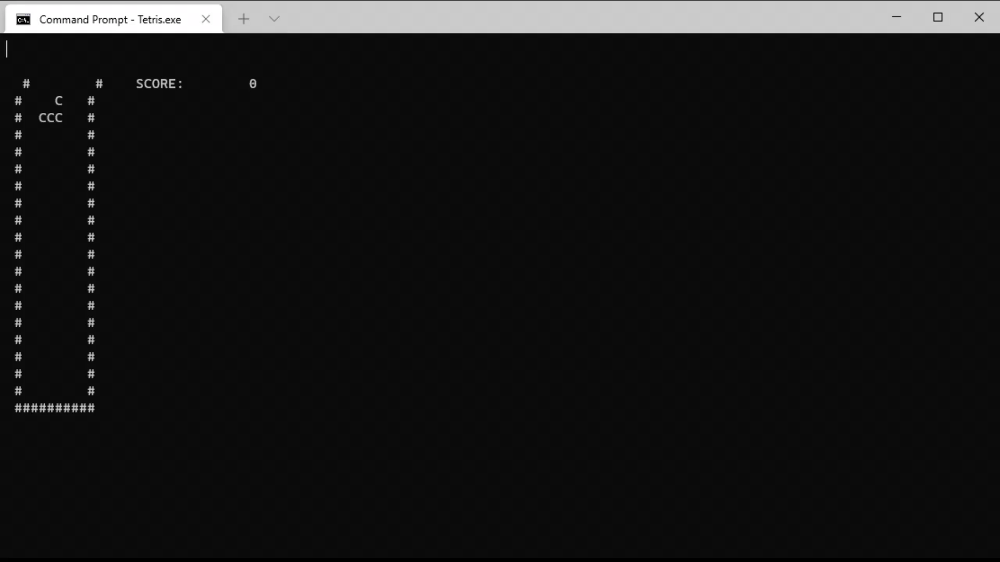

# Tetris
> A simple Tetris clone

## General Info
Have you ever been bored sitting at your command line? Static characters making your eyes dry out? Well, have I got the solution for you! A command line Tetris clone!

Growing up, [Tetris DS](https://en.wikipedia.org/wiki/Tetris_DS) was one of my favorite games. It was a mesmerizing game that I could play for hours.

One of the primary motivations for this project was to create a Tetris clone that could be played on the command line. So far, the game has achieved this goal and is in a playable state but it is still missing some features (see [To do's](#to-dos)).

Unfortunately, the game was designed using the [Windows API](https://docs.microsoft.com/en-us/windows/win32/) so it is not compatible with operating systems other than Windows. Also, the game has only been tested on Windows 10 so your mileage may vary on older Windows. 

There are some known issues so please check those before submitting a new Issue.

## Technologies
* Microsoft Visual Studio Community 2019, Version 16.9.4
* C++20
* Windows 10

## Setup
This project uses Visual Studio 2019 to build and compile the code.

## How to Play
To play the game, run the application on your command line. The game expects the terminal window to be 120x30. If the window does not match these dimensions, then the game will not display correctly.

### Controls
* Left, Right, Down
  * Arrow key Left, Right, and Down
* Rotate clockwise
  * Z key

### Scoring
You score 25 pts when you place a tetronimo, and 2^(number of lines) * 100 pts when you get lines.

## Features
* Basic Tetris gameplay
* Score tracking
* Line clearing

## To Do's
Tetris
* Ghost piece (where the piece will fall)
* Ability to hold a piece
* Future piece preview
* Display current speed level
* Improve speedup (currently doesn't seem like it speeds up much, if at all)
* Opposite direction rotation (you can only rotate in one direction at the moment)
* Colorful pieces
* Block pieces instead of letter pieces
* Wall-kick (when piece is next to a wall, move piece then rotate).
* Improve scoring

Code
* Remove raw pointers
* More abstractions (specifcally Windows API related parts)
* Improve fixed time step
* Move tetromino related information into the class

## Status
Project is: _in progress_

## Inspiration
This project is based on [Javidx9's](https://github.com/OneLoneCoder) Tetris project, which is a single file Tetris implementation that can be found [here](https://github.com/OneLoneCoder/videos/blob/master/OneLoneCoder_Tetris.cpp), and his tutorial video [here](https://youtu.be/8OK8_tHeCIA). I modified the source to be more modular and to utilize modern C++ features, including C++20 [modules](https://en.cppreference.com/w/cpp/language/modules) and [concepts](https://en.cppreference.com/w/cpp/concepts). The code is still a work in progress as there are many improvements to be made in terms of code.
